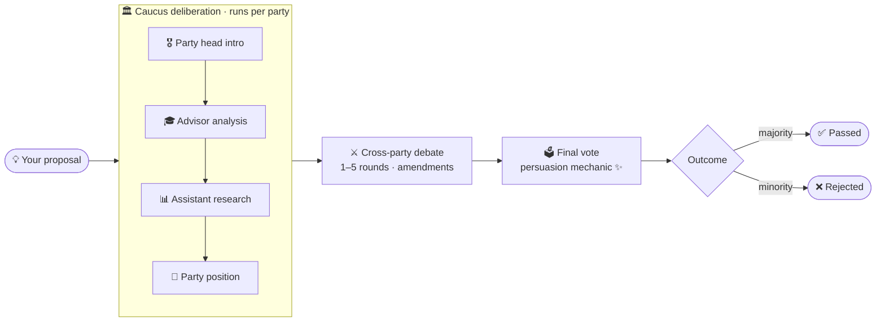

# 🗳️ Revolution

> *Where AI agents debate politics so you don't have to!* 🎭

A multi-agent political simulation where richly-drawn AI personas — Democrats and Republicans by default, plus a growing bench of Libertarians, Greens, Constitutionalists, Reformers, Forwards, Democratic Socialists, and Working Families — caucus internally, debate across the aisle, and vote on proposals you submit. Comes as a **CLI** and a **full web app** (FastAPI backend + React frontend) with a live legislative-chamber visualisation.

[](https://claude.com/claude-code)
[](https://www.python.org/)
[](https://github.com/langchain-ai/langgraph)
[](https://fastapi.tiangolo.com/)
[](https://react.dev/)
[](https://vitejs.dev/)

---

## 🎬 What is This?

Revolution is an **agentic experiment** that simulates political negotiations using LangGraph for orchestration and Claude for reasoning. Users submit proposals (e.g., *"Should we implement universal basic income?"*), and the system runs a full deliberation process: each caucus first deliberates privately, then meets the other caucuses on the chamber floor, then votes — and agents can change their minds along the way.


> 🪧 The default chamber seats Democrats vs. Republicans, but you can register additional caucuses from the [Party Manager](docs/USER_GUIDE.md#7-️-party-manager) and seed them with your own personas. The engine currently runs the deliberation flow for the two seeded caucuses; extending it to dynamic parties is on the [roadmap](#-contributing).

### 🌀 The deliberation pipeline



After the gavel falls, every debate gets a tabbed results page — overview hemicycle, per-agent vote breakdown, persuasion timeline, full transcript, and amendments — plus one-click PDF / Markdown / JSON export.


👉 **Want the full tour?** → **[Read the User Guide](docs/USER_GUIDE.md)** — every screen, every panel, every screenshot.

## ✨ Features

| Feature | Description |
|---------|-------------|
| 🎭 **Richly-drawn personas** | Every agent carries a documented philosophy, communication style, red lines, rhetorical signatures, and per-agent relationships |
| 🏛️ **Party hierarchy** | Party Head → Senior Advisors → Policy Assistants, with the head synthesising the caucus position |
| 🔄 **Multi-round debates** | 1–5 configurable cross-party negotiation rounds with amendment tabling |
| 🤝 **Persuasion mechanic** | Agents can change their vote during deliberation; the Persuasion Timeline tells the story |
| 🎨 **Beautiful CLI** | Party-colored panels rendered with Rich |
| 🌐 **Live web app** | FastAPI backend + React/Vite frontend with a live hemicycle, SSE streaming, and per-debate dashboards |
| 🎒 **Persona Manager** | Browse, search, edit, and create personas; group by caucus; tune posture, positions, and relationships inline |
| 🏳️ **Party Manager** | Curate caucus ideology, motto, history, key policies, color, and roster |
| 🕸️ **Relationship Graph** | Intra-party ally / rival visualization that explains *why* caucuses cohere or splinter |
| ⚙️ **Settings** | Editable engine credentials, eight system prompts, and reference vocabularies — all persisted to `data/settings.json` and shared with the CLI |
| 📄 **Export** | One-click PDF, Markdown, and JSON export of any debate (transcript + votes + amendments) |

## 🧾 Example Output

Want to see what a full negotiation looks like? Check out this example session:

👉 **[UBI Negotiation Example](examples/ubi_negotiation.md)** — A complete 2-round debate on Universal Basic Income (result: 11-11 REJECTED)

## 🎒 The Seeded Roster (Democrats + Republicans)

These 22 personas ship as the default chamber and are what the LangGraph deliberation flow runs end-to-end today. Many more (Libertarians, Greens, Constitutionalists, Reformers, Forwards, Democratic Socialists, Working Families — each with their own real-politician personas) are available in the [Persona Manager](docs/USER_GUIDE.md#6--persona-manager).

### 🔴 Republican Party (11 agents)

| Role | 👤 Name | 🏷️ Title | 🎯 Specialty |
|------|---------|----------|--------------|
| 🎖️ Party Head | Mike Johnson | Speaker of the House | Legislative Strategy |
| 🎓 Advisor | John Thune | Senate Majority Leader | Tax/Fiscal Policy |
| 🎓 Advisor | Tom Cotton | Senator from Arkansas | National Security |
| 🎓 Advisor | Josh Hawley | Senator from Missouri | Cultural Conservatism |
| 🎓 Advisor | Ted Cruz | Senator from Texas | Constitutional Law |
| 📊 Assistant | Steve Scalise | House Majority Leader | Federal Budget |
| 📊 Assistant | Marco Rubio | Secretary of State | International Trade |
| 📊 Assistant | John Barrasso | Senate Majority Whip | Energy Policy |
| 📊 Assistant | Rand Paul | Senator from Kentucky | Healthcare Policy |
| 📊 Assistant | JD Vance | Vice President | Immigration Policy |
| 📊 Assistant | Lindsey Graham | Senator from South Carolina | Policy Strategy |

### 🔵 Democrat Party (11 agents)

| Role | 👤 Name | 🏷️ Title | 🎯 Specialty |
|------|---------|----------|--------------|
| 🎖️ Party Head | Chuck Schumer | Senate Minority Leader | Caucus Strategy |
| 🎓 Advisor | Elizabeth Warren | Senator from Massachusetts | Financial Regulation |
| 🎓 Advisor | Alexandria Ocasio-Cortez | Representative from New York | Climate Action |
| 🎓 Advisor | Cory Booker | Senator from New Jersey | Criminal Justice/Civil Rights |
| 🎓 Advisor | Jamie Raskin | Representative from Maryland | Constitutional Law |
| 📊 Assistant | Hakeem Jeffries | House Minority Leader | Budget Strategy |
| 📊 Assistant | Bernie Sanders | Senator from Vermont | Labor/Inequality |
| 📊 Assistant | Patty Murray | Senator from Washington | Healthcare Policy |
| 📊 Assistant | Katherine Clark | House Minority Whip | Education Policy |
| 📊 Assistant | Ilhan Omar | Representative from Minnesota | Immigration/Refugees |
| 📊 Assistant | Amy Klobuchar | Senator from Minnesota | Antitrust/Tech Policy |

## 🚀 Quick Start

### Prerequisites

- 🐍 Python 3.11+
- 📦 Node 22+ and pnpm (via `corepack`) — only needed for the web app
- 🔑 Anthropic API key

### Installation

```bash
# 1️⃣ Clone the repository
git clone https://github.com/floriangrousset/Revolution.git
cd Revolution

# 2️⃣ Create and activate virtual environment
python -m venv venv
source venv/bin/activate  # On Windows: venv\Scripts\activate

# 3️⃣ Install dependencies
pip install -r requirements.txt

# 4️⃣ Configure your API key
cp .env.example .env
# Edit .env and add your ANTHROPIC_API_KEY
# (You can also set the key from the web app's Settings page — see the User Guide.)
```

### Usage — CLI

```bash
python -m src.main
```

You'll be prompted to:

1. 📝 Enter your proposal (e.g., *"Should we legalize marijuana?"*)
2. 🔢 Set the maximum number of negotiation rounds (1–5)

Then sit back and watch the political fireworks! 🎆

### Usage — Web app 🌐

The web app wraps the same LangGraph engine in a FastAPI backend with a React/Vite frontend. It adds the Persona Manager, Party Manager, Relationship Graph, Launch screen, Settings, live legislative-chamber view with SSE streaming, and PDF/Markdown/JSON export.

```bash
# Terminal 1 — backend (FastAPI on :8000)
python -m uvicorn server.main:app --reload
# or, after `pip install -e .`:
revolution-server

# Terminal 2 — frontend (Vite on :5173)
cd web
pnpm install        # first run only
pnpm dev
```

Open **http://localhost:5173** and navigate around:

- **🏛️ The Floor** — Dashboard with chamber composition, KPIs, and recent deliberations
- **🚀 Launch a Debate** — Compose a motion, pick rounds (1–5) and temperature, choose participating caucuses, and watch the session forecast update live
- **🎙️ Live debate / Results** — A hemicycle that lights up as agents take the floor, plus tabs for `Overview`, `Vote Breakdown`, `Persuasion Timeline`, `Transcript`, and `Amendments`. Export to PDF / Markdown / JSON.
- **🎭 Persona Manager** — Browse, search, filter, view, edit, and create personas. Each profile holds philosophy, communication style, key positions, red lines, rhetorical signatures, and ally / rival relationships.
- **🏳️ Party Manager** — Curate caucus ideology, motto, history, key policies, color identity, and roster.
- **🕸️ Relationship Graph** — Intra-party ally / rival visualization with hover focus and a slide-up persona card.
- **⚙️ Settings** — API key, default model, default temperature, eight editable system prompts, and reference vocabularies. Everything writes to `data/settings.json` and is read by both the web app and the CLI.

The CLI (`python -m src.main`) keeps working unchanged — both run against the same persona JSON files (auto-seeded into `data/personas/` on first web boot).

📖 For a screen-by-screen walkthrough → **[docs/USER_GUIDE.md](docs/USER_GUIDE.md)**

## ⚙️ Configuration

| Variable | Description | Default |
|----------|-------------|---------|
| `ANTHROPIC_API_KEY` | Your Anthropic API key (CLI + initial web bootstrap; can also be set from the web Settings page) | **Required** |
| `MODEL_NAME` | Claude model — **CLI fallback only**; the web app uses the value set in Settings and lets you override per debate from Launch | `claude-sonnet-4-6` |
| `MAX_ROUNDS` | Default max negotiation rounds (CLI) | `5` |
| `DATA_DIR` | Where the web app stores its file DB | `./data` |
| `CORS_ORIGINS` | Allowed origins for the API | `http://localhost:5173` |

## 📁 Project Structure

```
Revolution/
├── src/                           # 🧠 Engine (CLI + library)
│   ├── main.py                    # 🚀 CLI entry point
│   ├── state/types.py             # 📋 NegotiationState + PartyState + reducers
│   ├── agents/                    # 🤖 Agent class + persona JSON
│   │   ├── base.py prompts.py
│   │   ├── republican.py democrat.py
│   │   └── data/{republican,democrat}/*.json
│   ├── graphs/                    # 🎯 LangGraph nodes + flow
│   │   ├── main_graph.py party_graph.py nodes.py
│   ├── voting/consensus.py        # 🗳️ Voting tally
│   └── cli/display.py             # 🎨 Rich console output
│
├── server/                        # 🌐 FastAPI backend
│   ├── main.py                    # App factory + uvicorn entry
│   ├── settings.py                # Env config (pydantic-settings)
│   ├── db.py                      # File-DB access (atomic writes, per-debate locks)
│   ├── engine.py                  # Wraps run_negotiation → SSE events
│   ├── events.py                  # SSE Event + EventBroadcaster
│   ├── exporters.py               # PDF / Markdown / JSON
│   └── routers/                   # personas, parties, relationships,
│                                  # debates, stream, settings
│
├── web/                           # ⚛️ React + Vite + TypeScript frontend
│   ├── index.html package.json vite.config.ts
│   └── src/
│       ├── App.tsx main.tsx theme.ts api.ts types.ts hooks.ts
│       ├── components/            # Icon, Avatar, Btn, Tags, Sidebar, …
│       └── screens/               # Dashboard, Launch, Results,
│                                  # Personas + PersonaDetail + AddPersonaModal,
│                                  # Parties, Graph, Settings, ExportModal,
│                                  # Placeholder
│
├── data/                          # 🗂️ Runtime file DB (gitignored)
│   ├── parties.json index.json settings.json
│   ├── personas/<party>/*.json    # Seeded from src/agents/data/ on first boot
│   └── debates/<id>/              # debate.json transcript.jsonl votes.json amendments.json
│
├── docs/                          # 📖 Documentation
│   ├── USER_GUIDE.md              # Full screen-by-screen tour
│   └── images/                    # Screenshots (1-dashboard, 2-launch-debate, …)
│
├── examples/
│   ├── sample_proposals.txt       # 💡 Example proposals
│   └── ubi_negotiation.md         # 📄 Example session output
├── requirements.txt pyproject.toml .env.example
└── tests/
```

## 🛠️ Tech Stack

| Technology | Purpose |
|------------|---------|
| [🔗 LangGraph](https://github.com/langchain-ai/langgraph) | Multi-agent orchestration |
| [🧠 Claude API](https://www.anthropic.com/) | LLM reasoning (Opus / Sonnet / Haiku) |
| [🎨 Rich](https://github.com/Textualize/rich) | Beautiful terminal output (CLI) |
| [⚡ FastAPI](https://fastapi.tiangolo.com/) | Async HTTP + SSE backend |
| [⚛️ React 18](https://react.dev/) + [Vite](https://vitejs.dev/) + TS | Frontend |
| [📄 ReportLab](https://www.reportlab.com/) | PDF export |
| [✅ Pydantic](https://docs.pydantic.dev/) + pydantic-settings | Data validation & config |

## 💡 Sample Proposals to Try

### ⚖️ Social Issues
- *"Should we legalize gay marriage nationwide?"*
- *"Should we implement stricter gun control measures?"*

### 💰 Economic Policy
- *"Should we raise the federal minimum wage to $15/hour?"*
- *"Should we implement a universal basic income?"*

### 🏥 Healthcare
- *"Should we implement Medicare for All?"*

### 🌍 Climate
- *"Should we implement a Green New Deal?"*

### ⚖️ Criminal Justice
- *"Should we abolish the death penalty?"*

## 🔄 How It Works

### Phase 1: 🏛️ Party Deliberation

Each party runs an internal subgraph:

1. **🎖️ Party Head Introduction** — Frames the proposal and sets the agenda
2. **🎓 Advisor Analysis** — Each of 4 advisors analyses from their expertise
3. **📊 Assistant Research** — 6 assistants provide supporting data
4. **📝 Position Synthesis** — Party head synthesises into the official caucus position

### Phase 2: ⚔️ Cross-Party Debate

- Party heads present their positions
- Advisors engage in point/counterpoint
- Amendments may be tabled
- **N rounds** are configurable per debate (1–5 from Launch)

### Phase 3: 🗳️ Final Voting

- Every seated agent votes: **SUPPORT** / **OPPOSE** / **ABSTAIN**
- Each provides reasoning grounded in their philosophy
- 🤝 **Persuasion mechanic**: a custom `add_votes` reducer keys votes by agent id, so an agent who's been swayed during cross-party debate can simply re-emit a different vote — the diff is what powers the **Persuasion Timeline** in the web UI
- Simple majority wins (50%+1 of non-abstaining votes)

## ⏱️ Performance Notes

| Metric | Value |
|--------|-------|
| ⏰ Session Time | 5–15 minutes (depending on rounds) |
| 📡 API Calls | ~50–100 per session |
| 💵 Recommended Model | Claude Sonnet (cost-efficient default) |
| 🏆 Premium Model | Claude Opus (higher quality) |

## 🤝 Contributing

Contributions are welcome! On the roadmap:

- 🗳️ **Extend the LangGraph flow to dynamic parties.** The Persona Manager, Party Manager, Relationship Graph, Launch screen, and persona storage already support N caucuses (Libertarian 🟡, Green 🟢, Constitution, Reform, Forward, Democratic Socialists, Working Families …). The deliberation flow itself is currently hard-coded to Democrats + Republicans — wiring it through to custom caucuses is the single biggest unlock.
- 🔊 **Token-level streaming for the live arena.** Today the SSE stream emits one event per completed turn (see the `astream` hook in `src/graphs/nodes.py`); finer-grained streaming would make the "composing remarks…" indicator feel even more alive.
- 🎭 **More personas.** Add real-politician profiles to the bench caucuses, or invent new ones entirely.
- 📜 **Amendment negotiation logic.** Today amendments are recorded but not folded back into the motion text — making them first-class state would unlock a richer back-and-forth.
- 📊 **Historical voting record tracking.** A leaderboard that shows which agents flip most, which caucuses pass the most motions, which postures (dealmaker vs. hardliner) actually win.

## 📄 License

MIT License — see LICENSE file for details.

---

<div align="center">

**Built with ❤️ and [Claude Code](https://claude.com/claude-code)**

*"Democracy is the art of thinking independently together." — Alexander Meiklejohn*

🗳️ **Happy Debating!** 🗳️

</div>
