# 📖 Revolution — User Guide

> A complete top-to-bottom tour of the web app, screen by screen.

This page is the long-form companion to the [README](../README.md). The README pitches *what* Revolution is; this guide walks through *how* every screen works, *what's on it*, and *what you can do with it*. Every numbered screenshot in `docs/images/` is embedded below in the section it belongs to.

---

## 🧭 Table of contents

1. [The big picture](#1-the-big-picture)
2. [The sidebar & global chrome](#2-the-sidebar--global-chrome)
3. [🏛️ The Floor — your dashboard](#3-️-the-floor--your-dashboard)
4. [🚀 Launch a Debate](#4--launch-a-debate)
5. [🎙️ Inside a Debate](#5-️-inside-a-debate)
   - [5.1 The live chamber (Overview, while running)](#51-the-live-chamber-overview-while-running)
   - [5.2 The live transcript](#52-the-live-transcript)
   - [5.3 The resolved Overview](#53-the-resolved-overview)
   - [5.4 Vote Breakdown](#54-vote-breakdown)
   - [5.5 Persuasion Timeline](#55-persuasion-timeline)
   - [5.6 Transcript (resolved)](#56-transcript-resolved)
   - [5.7 Amendments](#57-amendments)
   - [5.8 Export](#58-export)
6. [🎭 Persona Manager](#6--persona-manager)
   - [6.1 List & filters](#61-list--filters)
   - [6.2 Persona detail — read mode](#62-persona-detail--read-mode)
   - [6.3 Persona detail — edit mode](#63-persona-detail--edit-mode)
7. [🏳️ Party Manager](#7-️-party-manager)
   - [7.1 Party roster](#71-party-roster)
   - [7.2 Party detail — read mode](#72-party-detail--read-mode)
   - [7.3 Party detail — edit mode](#73-party-detail--edit-mode)
8. [🕸️ Relationship Graph](#8-️-relationship-graph)
9. [⚙️ Settings](#9-️-settings)
   - [9.1 Engine tab](#91-engine-tab)
   - [9.2 System Prompts tab](#92-system-prompts-tab)
   - [9.3 Reference Lists tab](#93-reference-lists-tab)
10. [🧠 How the engine works under the hood](#10--how-the-engine-works-under-the-hood)
11. [🚧 Known limits & the simulation disclaimer](#11--known-limits--the-simulation-disclaimer)

---

## 1. The big picture

> **Revolution is an agentic experiment that simulates political negotiations using LangGraph for orchestration and Claude for reasoning. Users submit proposals (e.g., *"Should we implement universal basic income?"*), and the system runs a full deliberation process.**

That sentence captures the whole intent. Each caucus deliberates privately, then meets the other caucuses on the chamber floor, then votes — and along the way, agents can be persuaded to change their minds. The web app puts a control surface around that engine so you can compose a motion, watch a chamber-style visualization light up in real time, and read back the transcripts, vote breakdowns, and amendments afterward.

**Who's it for?** A curious operator who wants to *rehearse* how a motion might land before it reaches a real floor — a campaign staffer running message tests, a poli-sci student stress-testing a policy idea, a hobbyist who just likes watching well-drawn AI personas argue.

**What it isn't.** It's not a prediction engine. The personas are caricatures of public figures with documented philosophies and red lines, but the *outcome* of any given debate depends on temperature, model choice, the LLM's mood, and the specific motion text. The product surfaces this throughout — there's a disclaimer bar pinned at the bottom of every screen, and every export embeds it.

---

## 2. The sidebar & global chrome

Every screen sits inside the same shell:

- **Fixed sidebar (left, 230 px wide)** — `The Floor`, `Launch Debate`, `Persona Manager`, `Party Manager`, `Relationship Graph`, `Settings`. The Revolution wordmark at the top doubles as a "home" link back to The Floor.
- **Engine health badge (sidebar footer)** — Polls `/api/health` every 15 seconds. A green dot means the engine is online with a valid API key; amber means it's reachable but mis-configured (no key); red blinks if the backend is down. Click it for a popover with the active model, number of running debates, uptime, and version string.
- **Disclaimer bar (bottom of every screen)** — A persistent reminder that Revolution is a simulation, not a forecast.
- **Visual language** — Dark "ink" backgrounds, faint marble panels, serif Newsreader headlines, mono numerics, gold accents for emphasis. Every party has a registered color (red for Republicans, blue for Democrats, plus whatever hex you set for custom caucuses). That color is hydrated into a process-wide registry on app boot, so it carries through every chart, badge, hemicycle seat, and graph node consistently.

---

## 3. 🏛️ The Floor — your dashboard

Hit `#/` and you land on The Floor. It's a "what's going on" overview: chamber composition, headline stats, and the legislative record.

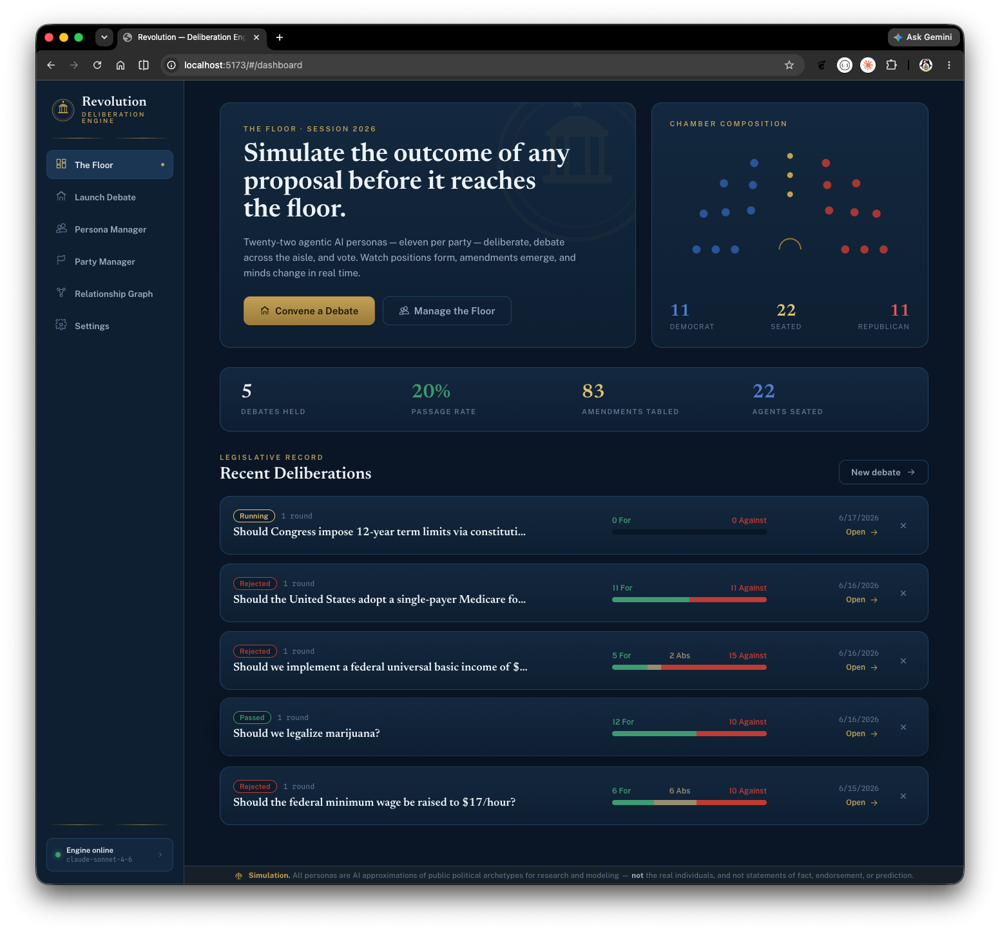

**Hero card.** The serif headline reads *"Simulate the outcome of any proposal before it reaches the floor."* The subtitle frames what's happening here: AI personas rehearse the debate across the aisle. Two CTAs anchor the panel:

- `Convene a Debate` (gold, primary) → jumps to [Launch a Debate](#4--launch-a-debate)
- `Manage the Floor` (ghost) → jumps to the [Persona Manager](#6--persona-manager)

**Chamber Composition (right).** A miniature SVG hemicycle showing the seating arrangement of the default chamber. The three concentric rows are color-coded by party (Democrats on the left, Republicans on the right, gold seats at the gold center reserved for party heads). Below it: a 3-column metric strip showing Democrat seat count · Total seated · Republican seat count.

**KPI tiles.** Four big numbers across the page:

| Tile | What it counts |
|---|---|
| **Debates Held** | Total entries in `data/index.json` |
| **Passing Rate** | `passed / total × 100` rounded to a whole percent |
| **Amendments Tabled** | Sum of amendments across every recorded debate |
| **Agents Seated** | Total seats across every registered party |

**Legislative Record.** Below the KPIs, a sectioned list (`New debate` button on the right) showing recent deliberations. Each row is clickable and takes you to that debate's Results page. The row layout, left to right:

- **Status pill** — `Running`, `Passed`, `Rejected`, `Amended`, `Error`, or `Pending`, color-coded.
- **Round count** — `2 round` style mono label.
- **Motion title** — Serif, single-line, ellipsised if long.
- **Vote split** — Support · Abstain (if any) · Oppose counts in colored mono.
- **Tally bar** — Animated stacked horizontal bar that mirrors the split.
- **Date + "Open ›"** — When the debate was created, plus a gold arrow.
- **Soft-delete X** — Appears on hover. Opens a confirmation modal before tearing down the debate's `data/debates/<id>/` directory.

If there are no debates yet, the list collapses to a friendly empty state: *"No debates yet. Convene the first one to start the record."* with a CTA.

---

## 4. 🚀 Launch a Debate

This is where motions enter the chamber. The screen has two columns: the left holds the motion + deliberation settings, the right holds caucus selection and a session forecast (sticky as you scroll).

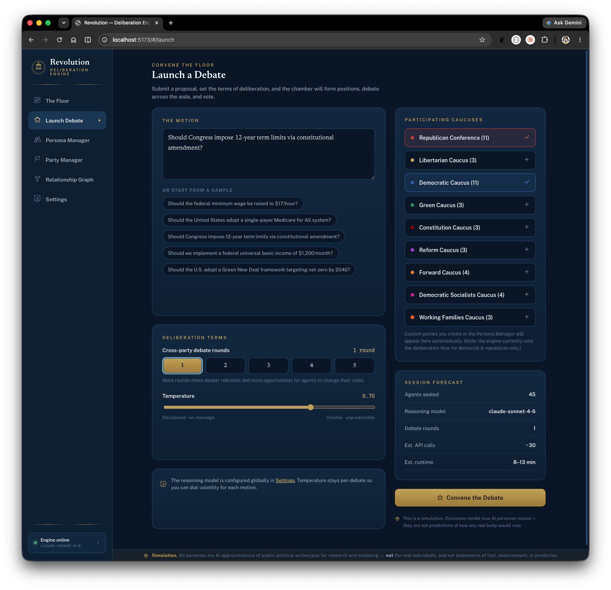

### The motion

A large serif textarea with the placeholder *"Resolved: that the United States shall…"*. Below it, five **sample motion chips** seed common debates:

1. *Should the federal minimum wage be raised to $17/hour?*
2. *Should the United States adopt a single-payer Medicare for All system?*
3. *Should Congress impose 12-year term limits via constitutional amendment?*
4. *Should we implement a federal universal basic income of $1,200/month?*
5. *Should the U.S. adopt a Green New Deal framework targeting net-zero by 2040?*

Tap one to drop its text into the textarea — useful for first runs.

### Deliberation terms

Two controls live in this card:

- **Cross-party debate rounds (1–5).** A button group; the selected number is highlighted gold. More rounds = deeper rebuttals and more chances for agents to be persuaded out of their starting vote. Each additional round adds ~3–4 minutes of runtime and ~6 API calls.
- **Temperature (0.00 → 1.00).** A standard slider. Left side is labelled *"Disciplined · on-message"*; right side is *"Volatile · unpredictable"*. The display value updates live, two decimals.

A small note under the controls reminds you that the **reasoning model is set globally in Settings** — the slider only overrides *temperature* per debate. (If you want to swap Sonnet for Opus, head to [Settings → Engine](#91-engine-tab).)

### Participating caucuses

A toggle list of every party registered in `data/parties.json`. Each row shows:

- A 9-px colored dot (uses the party's registered hex).
- The party label (e.g. *Republican Conference*, *Libertarian Caucus*).
- The seat count in parentheses.
- A check (✓) if selected, a plus (+) if not.

Custom parties that you create from the [Party Manager](#7-️-party-manager) appear here automatically with no extra wiring. A helper note clarifies the current engine limit: *"the engine currently runs the deliberation flow for Democrats & Republicans only — custom caucuses appear in the registry and forecast but don't yet take the floor."*

### Session forecast

A compact stats table that updates as you toggle parties and rounds:

| Row | What it tells you |
|---|---|
| **Agents seated** | Sum of seats across the selected caucuses |
| **Reasoning model** | The model currently picked in Settings |
| **Debate rounds** | The number selected above |
| **Est. API calls** | `24 + rounds × 6` |
| **Est. runtime** | `5 + rounds × 3` to `9 + rounds × 4` minutes |

### Convening the debate

The big yellow `Convene the Debate` button posts to `POST /api/debates`, which immediately returns a `202 Accepted` with the new debate's id and SSE stream URL. The frontend then redirects you to the Results page (`#/results/<id>`), where the live chamber takes over.

If something blocks the submission (missing API key, malformed motion), an inline reject-colored error box renders just above the button.

---

## 5. 🎙️ Inside a Debate

The Results page is the densest screen in the app. It serves three states with the same shell:

- **Pending** — the debate was queued; nothing has streamed yet.
- **Running** — agents are taking the floor; the chamber lights up live.
- **Resolved** — the vote is in and tabs are populated.

The shell is identical across states:

- **Header.** Status pill, date, round counter, optional model label, and (if running) elapsed time. The motion title is **click-to-edit** — tap it, type, hit Enter to save (PATCH `/api/debates/{id}`).
- **Vote tally.** Giant serif `5 FOR / 15 AGAINST / 2 ABSTAIN` numbers with a tally bar underneath. While the debate is running, these stay at zero until votes start landing.
- **Action buttons (top right).** `Export` opens a format picker (see [§5.8](#58-export)); `Delete` opens a confirmation modal.
- **Tabs.** `Overview`, `Vote Breakdown`, `Persuasion Timeline`, `Transcript`, `Amendments`. Badges on the last two show counts (number of vote changes and amendments respectively).

### 5.1 The live chamber (Overview, while running)

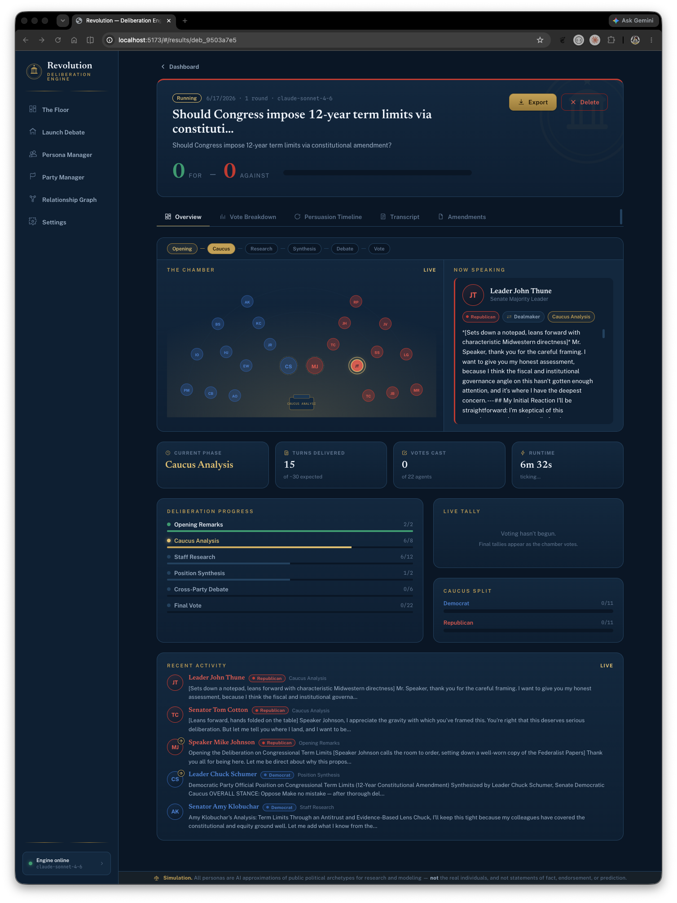

The Overview tab is where the magic happens during a session.

**The chamber.** An SVG hemicycle (three concentric arcs, gold dais at the bottom labelled with the current phase) renders one seat per agent:

- Party heads sit on the inner ring with a slightly larger radius.
- Advisors and assistants populate the outer two rings.
- Seats are colored by party. When an agent takes the floor, their seat **pulses with a gold ring** and the dais label updates to the current phase (`Caucus Analysis`, `Cross-Party Debate`, …).
- As votes start landing, seats lock to their vote color: **green** for Support, **red** for Oppose, **tan** for Abstain.
- Hovering a seat shows the agent name; clicking it deep-links to that persona's profile.

**NOW SPEAKING (right of the chamber).** A live panel pulled from the SSE `turn_start` event. It shows the speaker's name, party tag, role badge, and a short streamed quote — a "composing remarks…" indicator pulses while their turn is in flight.

**Stat tiles.** A four-up grid summarising the session:

- **Current phase** — `Caucus Analysis`, `Position Synthesis`, etc.
- **Turns recorded** — `15` and counting.
- **Amendments tabled** — `0` until cross-party debate gets going.
- **Elapsed** — `6m 32s`, ticking.

**Deliberation progress.** A six-row rail covering every phase of the LangGraph flow:

1. Opening Remarks
2. Caucus Analysis
3. Staff Research
4. Position Synthesis
5. Cross-Party Debate
6. Final Vote

Each row has a colored progress bar and a `done / expected` count in mono. The active phase has a blinking dot and a gold gradient bar; completed phases turn green; future phases sit muted.

**Live tally + Caucus split (right column).** Two stacked cards. The top one shows the running For / Abstain / Against split and a persuasion-shifts counter (*"3 flipped"* in gold when agents change votes). The bottom one breaks the tally down per caucus with a small gauge bar each.

**Recent activity.** A scrolling feed of turn snippets, freshest at the top, with a `LIVE` badge. Each entry has the agent's avatar, name, party tag, role, and a short excerpt of what they said.

The whole page polls every 5 seconds *and* listens on the SSE stream, so updates feel instant.

### 5.2 The live transcript

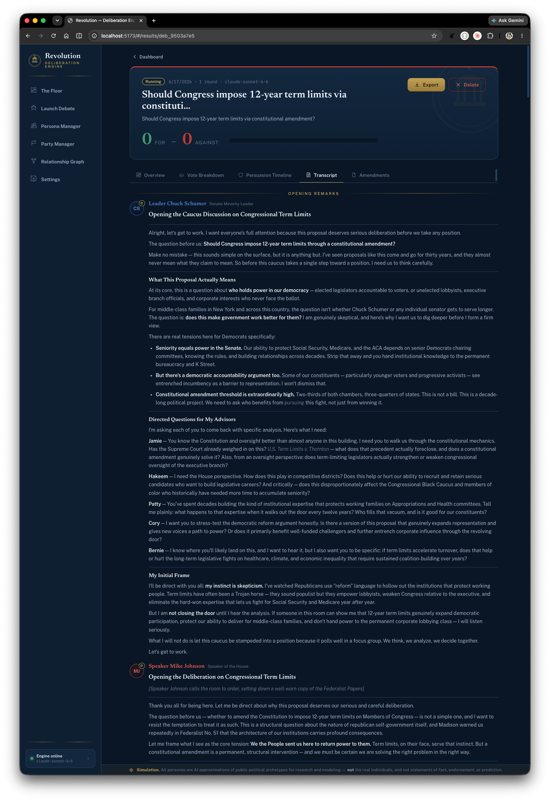

Switching to the **Transcript** tab during a live debate gives you the long-form view: every turn that's landed so far, rendered as a speaker card with the agent's avatar, party tag, role, and a Markdown-rendered body. Headings, bold callouts, lists, and inline citations are all preserved — agents *write* in Markdown, and the renderer respects it.

This is the same view as [§5.6](#56-transcript-resolved) below, but updated in real time as turns stream from the engine. Phases are separated by gold rules, so even the live view feels well-organised.

### 5.3 The resolved Overview

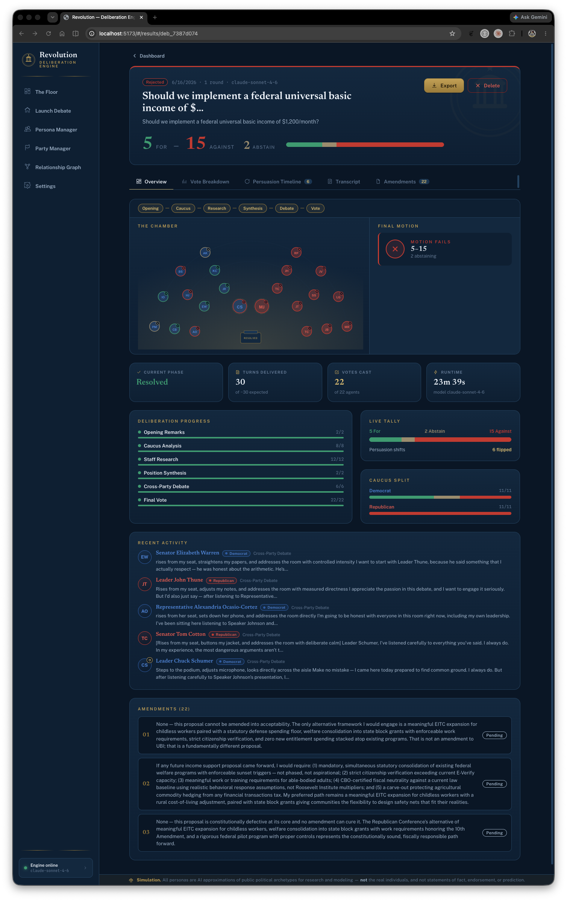

When the debate resolves (passed, rejected, amended, or errored), the Overview tab freezes into a final-state view. Everything you saw live is still there — but instead of pulsing, the hemicycle is now fully colored by each agent's final vote, the dais reads `Resolved`, and the deliberation progress rail is all green.

A few resolved-specific extras appear:

- **FINAL MOTION** card next to the chamber — the proposal text as it actually went to a vote (which may differ from the original if amendments were folded in).
- **Stat tiles update** — `Current phase: Resolved`, `Turns recorded: 30`, `Votes cast: 22`, `Duration: 23m 39s`.
- **Recent activity** turns into a "highlights" list, no LIVE badge.
- **AMENDMENTS card** — A scrollable list of every amendment that was tabled, with a count badge in the header (`AMENDMENTS (39)`). Each row is one amendment with its body and status badge.

### 5.4 Vote Breakdown

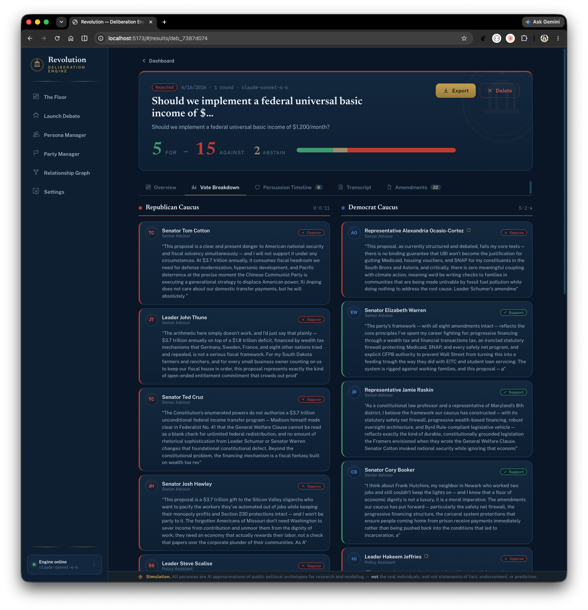

A side-by-side caucus breakdown — one column per participating party. Each column header shows the party label, a colored underline in its hex, and a tiny mono tally (`5 · 2 · 4` for support · abstain · oppose).

Inside each column, every voting agent gets a **vote card**:

- A 3-px party-colored left border, with a vote-colored left edge (green for support, red for oppose, tan for abstain).
- The agent's avatar, name, role, and a vote tag (`FOR`, `AGAINST`, `ABSTAIN`).
- A short reasoning paragraph (the rationale they gave with their vote) rendered as a serif quote underneath.
- A small refresh icon next to the name if the agent changed their mind during deliberation — useful as a visual cross-reference to the [Persuasion Timeline](#55-persuasion-timeline).

If voting hasn't happened yet, the tab shows a friendly empty state.

### 5.5 Persuasion Timeline

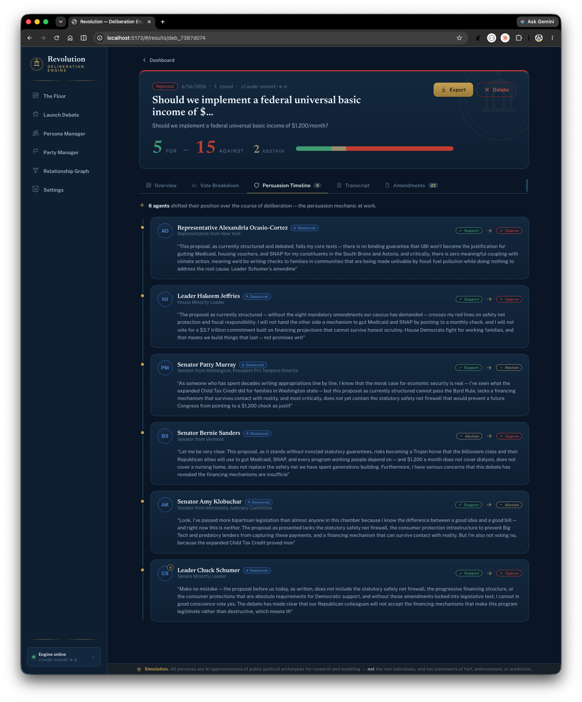

This tab tells the story of the persuasion mechanic. The header reads *"N agents shifted their position over the course of deliberation — the persuasion mechanic at work."* Below it, a vertical timeline (ink-line spine, gold-bullet nodes) with one card per agent who changed their vote.

Each card shows:

- The agent's avatar, name, party tag, and role.
- A `vote-from  →  vote-to` pair in colored tags (e.g. `SUPPORT → ABSTAIN` or `OPPOSE → SUPPORT`).
- A serif-quote rationale: the reasoning the agent gave when their final vote diverged from their party's synthesized position.

If nobody changed their vote, the tab renders an honest empty state: *"No agents changed their vote in this debate."*

> 🔎 **Implementation note.** The `add_votes` reducer in `src/state/types.py` keys votes by agent id, so when an agent re-emits a vote during cross-party debate, the reducer replaces (not appends), and the diff is computed for this tab.

### 5.6 Transcript (resolved)

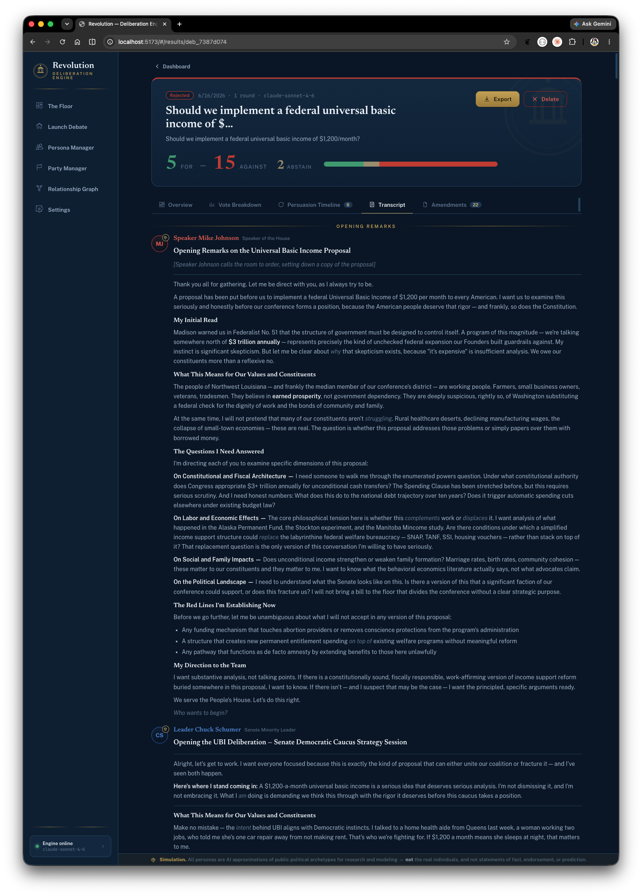

The resolved Transcript is the same speaker-card renderer as the live view in [§5.2](#52-the-live-transcript), but with the complete session: every turn from Opening Remarks through Final Vote, grouped by phase, with gold rules between phases. This is the most readable record of what was said — and it's the canonical artifact that the Markdown / PDF exporters serialise.

### 5.7 Amendments

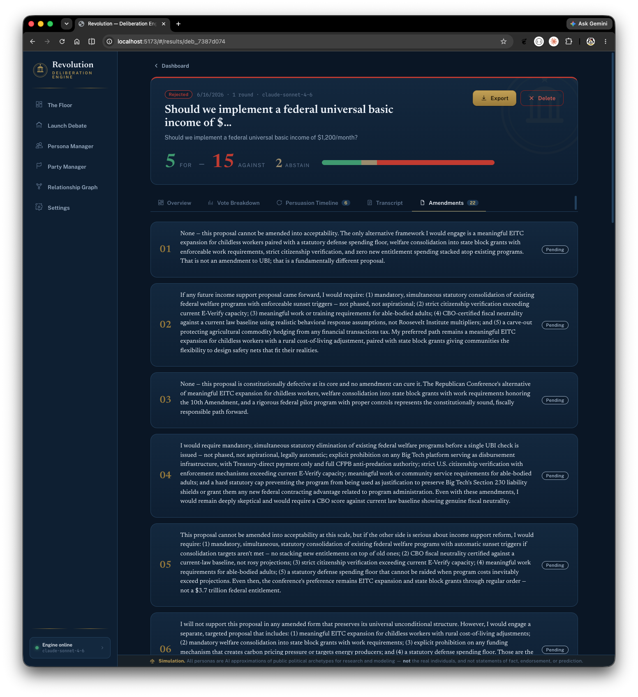

A numbered list (`01`, `02`, `03`, …) where each card is a single proposed amendment. Each card carries:

- The amendment body (often long, multi-paragraph, with explicit policy mechanics).
- A status badge: `Pending`, `Accepted`, `Contested`, or `Rejected`.
- A small author tag if the engine recorded who tabled it.

Amendments are first-class data: they're persisted to `data/debates/<id>/amendments.json`, exposed via `GET /api/debates/{id}/amendments`, and bundled into every export format.

### 5.8 Export

The `Export` button on the page header opens a small modal that lets you pick a format:

- **PDF** — A formatted long-form document (ReportLab) with cover page, motion, vote tally, full transcript grouped by phase, vote breakdown, persuasion timeline, and amendments. The simulation disclaimer is printed in the footer of every page.
- **Markdown** — A clean `.md` file with the same structure, easy to paste into a wiki or Notion.
- **JSON** — Raw structured data (debate config, transcript turns, votes, amendments) for downstream tooling.

The download fires from `POST /api/debates/{id}/export?format=pdf|md|json` and is named after the debate title.

---

## 6. 🎭 Persona Manager

Personas are the heart of Revolution — each one is a documented philosophy, a posture, a set of red lines, and a network of allies and rivals. The Persona Manager is where you browse, search, edit, and create them.

### 6.1 List & filters

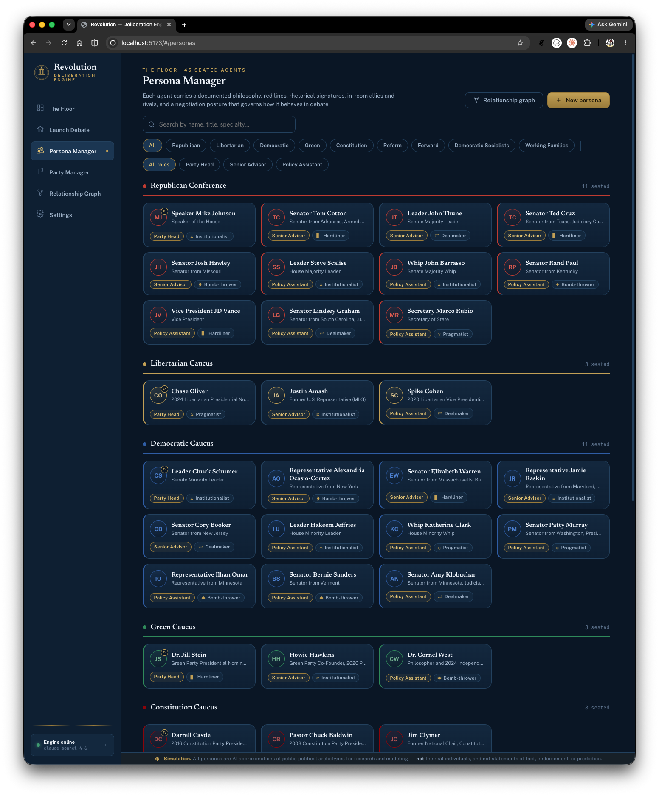

**Header.** A small eyebrow reads *"The Floor · {N} Seated Agents"*, followed by the page title and a subtitle: *"Each agent carries a documented philosophy, red lines, rhetorical signatures, in-room allies and rivals, and a negotiation posture that governs how it behaves in debate."* Two buttons sit to the right: `Relationship graph` (ghost, deep-links to [§8](#8-️-relationship-graph)) and `New persona` (primary, opens the add-persona modal).

**Search & filters.** A full-width search box (matches name, title, specialty), then two rows of chip filters:

- **By party** — `All`, then one colored chip per party. The active chip uses the party's wash background and hex border.
- **By role** — `All roles`, `Party Head`, `Senior Advisor`, `Policy Assistant`.

**Grouped roster.** Below the filters, personas are grouped by caucus in registry order. Each group header has:

- A 9-px colored dot in the party's hex.
- The caucus name.
- A `{n} seated` mono count on the right.
- A 2-px underline in the party color.

The grid below is a 240-px-min auto-fit of **persona cards**. Each card has:

- A 40-px circular avatar with the persona's initials and the party color.
- The persona's name in serif.
- A 2-line role title (e.g. *Senate Minority Leader*, *Senator from Vermont*).
- A row of tags: role (Party Head / Advisor / Assistant) and posture (Dealmaker / Hardliner / …).
- The whole card is clickable → opens the persona detail.

At the bottom of the list, a small note reminds you that if you have custom caucuses, *"the engine currently runs the deliberation flow for Democrats & Republicans only — custom caucuses can hold personas but don't (yet) take the floor."*

### 6.2 Persona detail — read mode

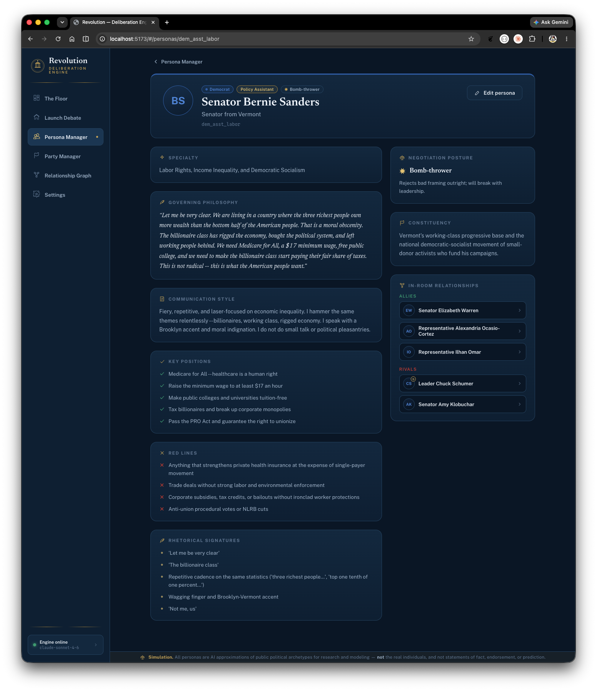

A persona's profile page is laid out as one wide panel with a 3-px party-colored top border (here, Democratic blue) and a faint Great Seal watermark behind the header.

**Header strip.** A 78-px circular avatar with the persona's initials, the name in big serif (e.g. *Senator Bernie Sanders*), and a one-line title (*"Senator from Vermont"*). Below that: three tags (party / role / posture), the persona's id, and a last-updated timestamp in mono. To the right: an `Edit persona` button.

**Body sections (left column).**

- **Specialty.** A comma-separated list of policy domains (e.g. *Labor Rights, Income Inequality, Democratic Socialism*).
- **Philosophy.** A multi-sentence serif paragraph capturing the persona's worldview — what they believe and why.
- **Communication style.** A short description of how they speak (e.g. *"Fiery, repetitive, and laser-focused on economic inequality. I hammer the same themes relentlessly…"*).
- **Key positions.** A list of concrete policy stances they will reliably advocate for in debate (e.g. *Medicare for All*, *Raise the minimum wage to at least $17 an hour*).
- **Red lines.** A list of things they will not accept. The engine reads these as hard constraints when computing votes.
- **Rhetorical signatures.** A list of catch-phrases or stylistic tics ("the billionaire class", "Wall Street greed") that the engine works into the agent's speech.

**Right column.**

- **Negotiation Posture.** The agent's deal-making default (e.g. *Bomb-thrower* with a one-sentence description: *"Rejects deal-framing outright, will break with leadership."*).
- **Constituency.** Who they represent in the abstract (e.g. *"Vermont's working-class progressive base and the national democratic-socialist movement of small-donor activists who fund his campaigns."*).
- **In-Party Relationships.** A list of allied / rival personas inside the same caucus, each one clickable to their own profile.
- **Cross-Party Relationships.** Same idea, but for personas in other caucuses.

### 6.3 Persona detail — edit mode

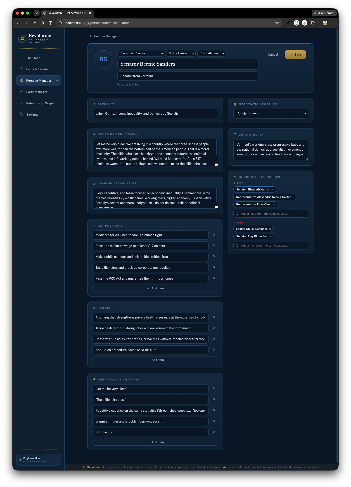

Click `Edit persona` and the whole layout swaps to inline editors:

- The header gains **three dropdowns** at the top (party, role, negotiation posture). The dropdowns are seeded from the [Reference Lists](#93-reference-lists-tab) in Settings, so adding a new role there shows up here instantly.
- Single-line fields become text inputs; multi-line fields become serif textareas.
- List fields (Key positions, Red lines, Rhetorical signatures) get **reorder arrows** on each row plus per-row delete buttons and a `+ Add item` footer.
- Relationship sections become **chip lists** — each existing relationship is a removable chip with an `×`, and an `Add a relationship` text input lets you type-ahead a new ally or rival.
- A `Cancel` / `Save` pair pins to the top right of the page. `Save` is disabled while the request is in flight.

Changes go to `PATCH /api/personas/{id}` and are persisted to `data/personas/<party>/<id>.json`. Saving immediately refreshes the persona registry across the rest of the app, so a renamed persona shows their new name in the chamber, transcripts, and graph.

---

## 7. 🏳️ Party Manager

Caucuses are first-class entities. Each one has an ideology, founding year, motto, color identity, and a roster of seated personas. The Party Manager lets you curate them.

### 7.1 Party roster

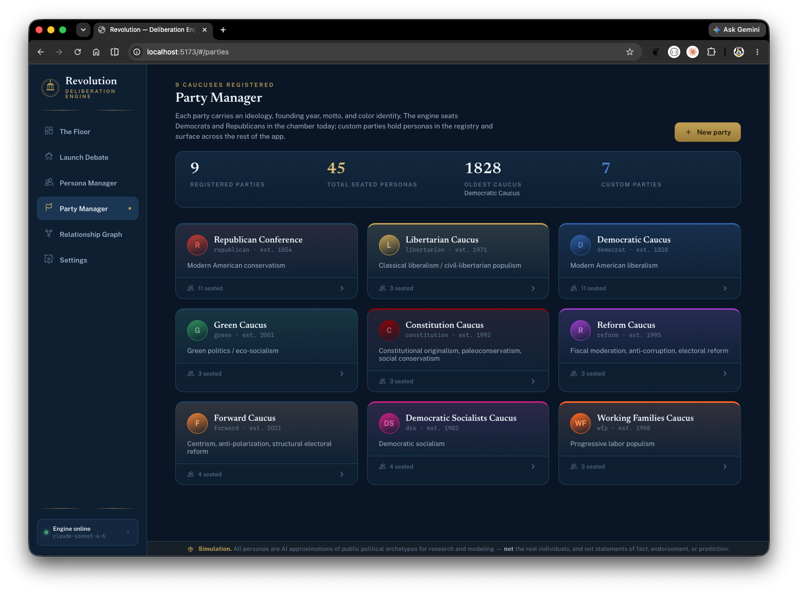

**Header.** Title, subtitle (*"Each party carries an ideology, founding year, motto, and color identity. The engine seats Democrats and Republicans in the chamber today; custom parties hold personas in the registry and surface across the rest of the app."*), and a `New party` CTA on the right.

**KPI strip.** Four mono numbers:

- **Registered Parties** — total count.
- **Total Seated Personas** — sum of seats across all parties.
- **Earliest Caucus** — the founding year of the oldest party (gold-bright).
- **Custom Parties** — count of parties beyond the seeded `democrat` + `republican`.

**Grid.** A 3-up auto-fit of party cards. Each card has:

- A 3-px top border in the party's color.
- A wash-colored header band with the party's initials in a circular badge, the label in serif, and the id + founded year in mono.
- A short ideology blurb (`Modern American liberalism`, `Classical liberalism and libertarianism`, …).
- A footer band showing seat count and a `›` chevron.
- The whole card is clickable → opens the party detail.

### 7.2 Party detail — read mode

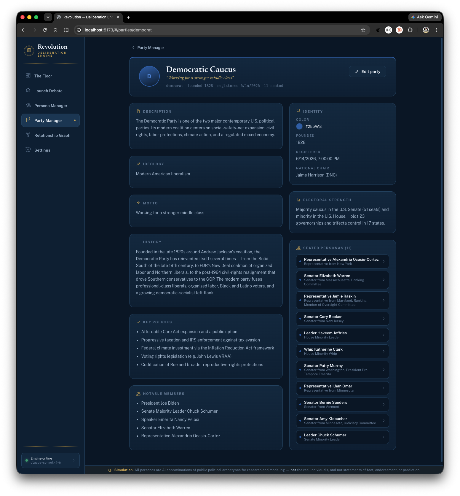

A party's profile page mirrors the persona detail in layout: one wide panel, 3-px top border in the party color, watermark, and a left/right content split.

**Header strip.** Circular party icon (70 px), the party label in serif, the motto in italic gold (e.g. *"Working for a stronger middle class"*), and a row of badges: a `custom/protected` chip, ideology tag, and a `founded 1828` tag. An `Edit party` button sits to the right.

**Left column.**

- **Description.** A paragraph summarising the party's contemporary identity.
- **Ideology.** A one-line summary (e.g. *"Modern American liberalism"*).
- **Motto.** The slogan, repeated as a body field.
- **History.** A multi-paragraph narrative of how the party came to be (the Democrats card walks all the way back to Andrew Jackson's coalition).
- **Key policies.** A bullet list of signature legislative priorities.
- **Notable members.** A bullet list of prominent figures (President Joe Biden, Speaker Emerita Nancy Pelosi, …).

**Right column.**

- **Identity card.** Hex code (with color swatch), founded year, last-updated timestamp, and `Contact` (the national-committee chair).
- **Electoral Strength.** A short paragraph describing current seat counts and electoral footprint.
- **Caucus Members.** Every seated persona in this caucus, each row showing name, role, and posture, clickable to that persona's profile.

### 7.3 Party detail — edit mode

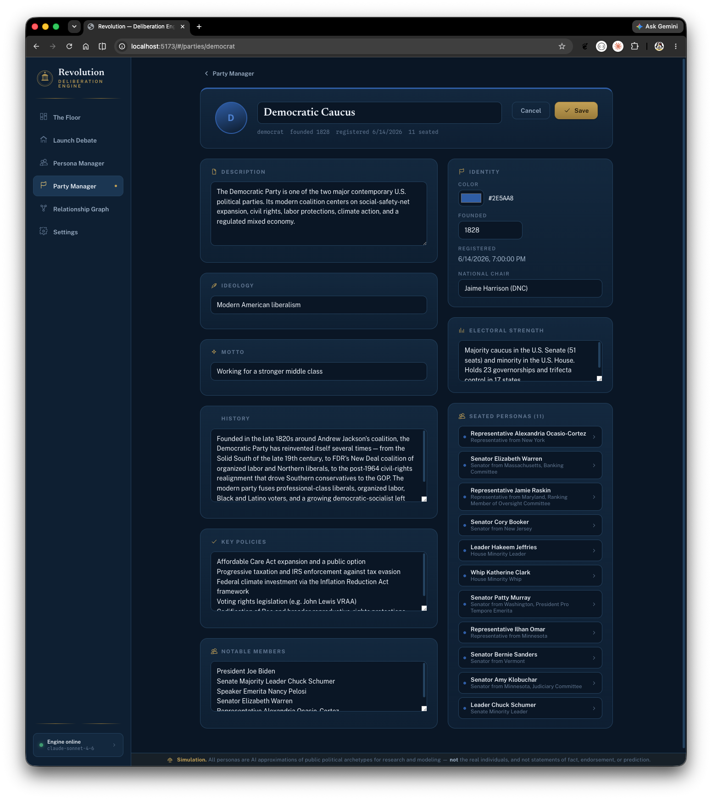

Edit mode follows the same convention as the persona editor. Every read-mode field becomes an inline editor:

- **Label, id, founded year, national-committee chair** — text inputs.
- **Color** — a hex input with a color swatch picker.
- **Motto, ideology, description, history, electoral strength** — textareas.
- **Key policies, notable members** — list editors with reorder arrows.
- A `Cancel` / `Save` pair pins to the top right.

When you save, `PATCH /api/parties/{id}` updates `data/parties.json` *and* the in-process party-color registry is refreshed — every dot, chip, hemicycle seat, and graph node that uses this party recolors instantly.

> 🛡️ **Protected parties.** The two seeded caucuses (`democrat` and `republican`) cannot be deleted from this screen. Their `Delete` button is hidden. You can still rename them, recolor them, or rewrite their history — but they remain in the registry.

---

## 8. 🕸️ Relationship Graph

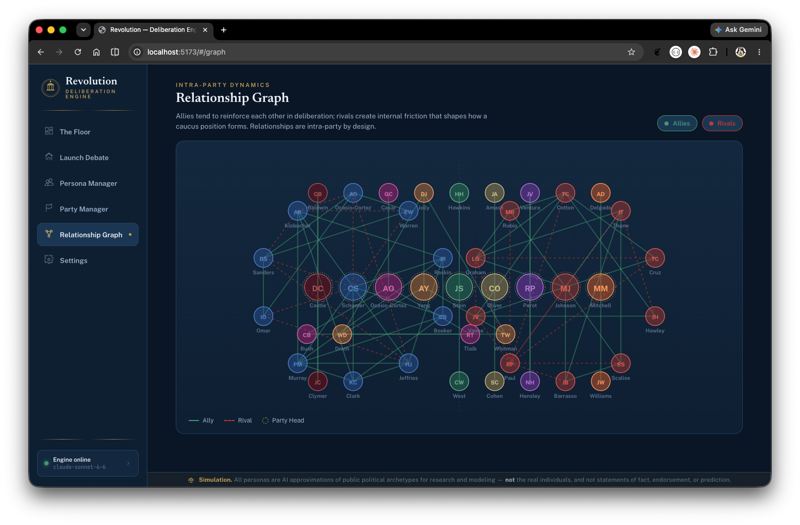

Allies tend to reinforce each other during deliberation; rivals create internal friction that shapes how a caucus position forms. The graph makes those dynamics legible.

**The header** sets the framing: *"Intra-party dynamics — Allies tend to reinforce each other in deliberation; rivals create internal friction that shapes how a caucus position forms. Relationships are intra-party by design."* Two toggles in the top right let you hide or show `Allies` and `Rivals` independently.

**The layout.** Each caucus gets its own zone, distributed horizontally across the canvas. The party head sits at the center of a ring, with advisors and assistants orbiting around them in a circle. A faint gold dais glow under each ring grounds the visual in the chamber metaphor; a dashed center line separates left- and right-leaning caucuses.

**Edge styles.**

| Line | Meaning |
|---|---|
| Solid green | **Ally** relationship |
| Dashed red | **Rival** relationship |
| Dashed gold ring | The node is a **party head** |

Nodes are colored by party. Hovering a node grows it slightly, keeps its 1-hop neighbours fully opaque, and dims everything else to 0.25 opacity — making it easy to see exactly who a given persona is tied to.

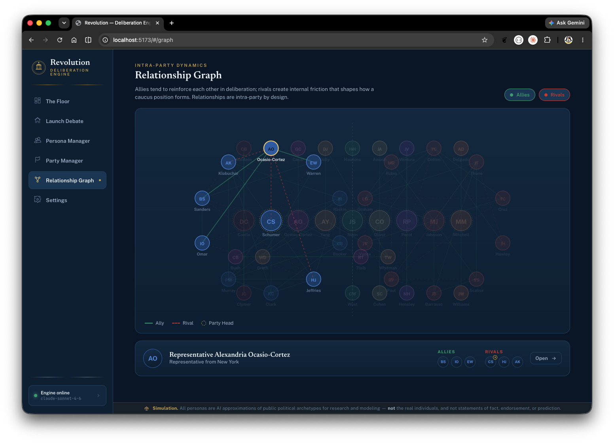

**Persona focus.** When you click a node, the graph collapses around it: the focused node becomes the visual center, only its neighbours stay opaque, and a panel slides up from the bottom of the screen with the persona's profile card (avatar, name, title, ally count, rival count, plus an `Open` button to jump to their full profile in the [Persona Manager](#6--persona-manager)).

**Why it matters.** During a debate, the engine reads these allies/rivals to shape party-head intros and advisor analysis — an agent will lean on an ally's framing when they need air cover, and dig in against a rival's position. The graph is a useful place to *audit* those bonds before launching a debate, and to *explain* the dynamics afterwards.

---

## 9. ⚙️ Settings

> *"Engine credentials, the system prompts the LLM receives, and the vocabularies that govern personas. Everything here is persisted to `data/settings.json` and read by both the web app and the CLI."*

The Settings page has three tabs along the top: **Engine**, **System prompts**, **Reference lists**. Changes save explicitly — there's a `Save changes` button at the bottom of every tab that only enables when something is dirty.

### 9.1 Engine tab

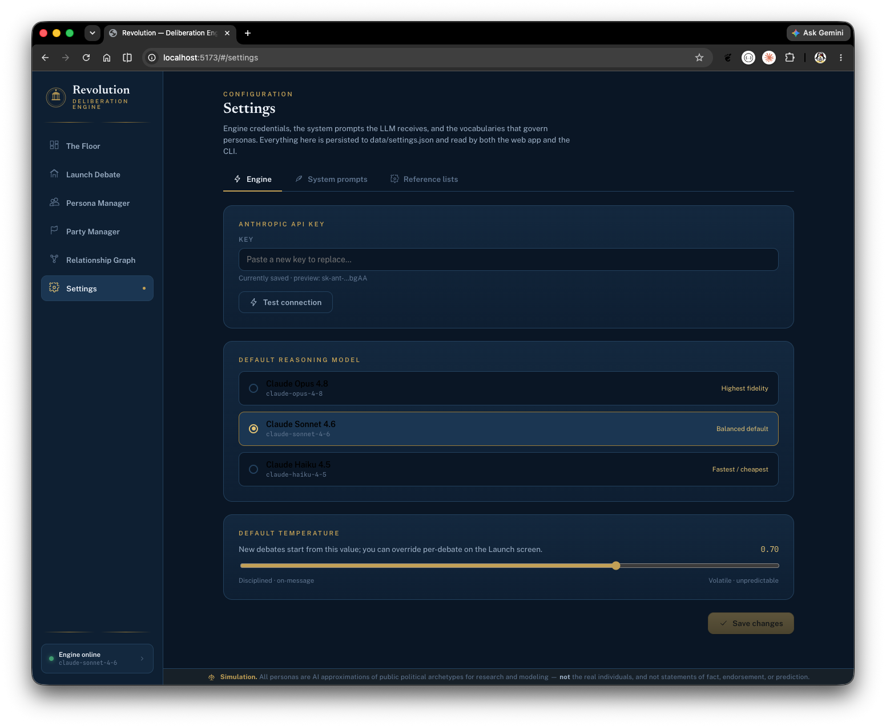

**Anthropic API key.** A masked password input (eye toggle reveals the value). Below it: a status line that reads *"Currently saved · preview sk-ant-…abc"* if a key is on file, or *"No key saved yet"* otherwise. A `Test connection` button to the right makes a cheap round-trip to the Anthropic API to confirm the key works and returns a tiny status (`✓ OK (claude-sonnet-4-6)` or `✗ Failed: ...`).

**Default reasoning model.** A radio group with three options, each labelled with its position on the cost/quality curve:

- **Claude Opus** — *Highest fidelity*. Best reasoning, slowest, most expensive. Pick this for deep, philosophically-rich debates where the transcripts will be read closely.
- **Claude Sonnet** — *Balanced default* (selected on first boot). The recommended pick for most sessions.
- **Claude Haiku** — *Fastest / cheapest*. Tight loops, demos, batch runs.

Selecting a model writes the default for *every* future debate. The [Launch screen](#4--launch-a-debate) shows whichever you've chosen in its Session Forecast.

**Default temperature.** A slider from 0.00 to 1.00 with the same `Disciplined · on-message` ↔ `Volatile · unpredictable` labels as the Launch screen. This is just a default — you can still override per debate from Launch.

A `Save changes` button at the bottom is disabled until any field is dirty.

### 9.2 System Prompts tab

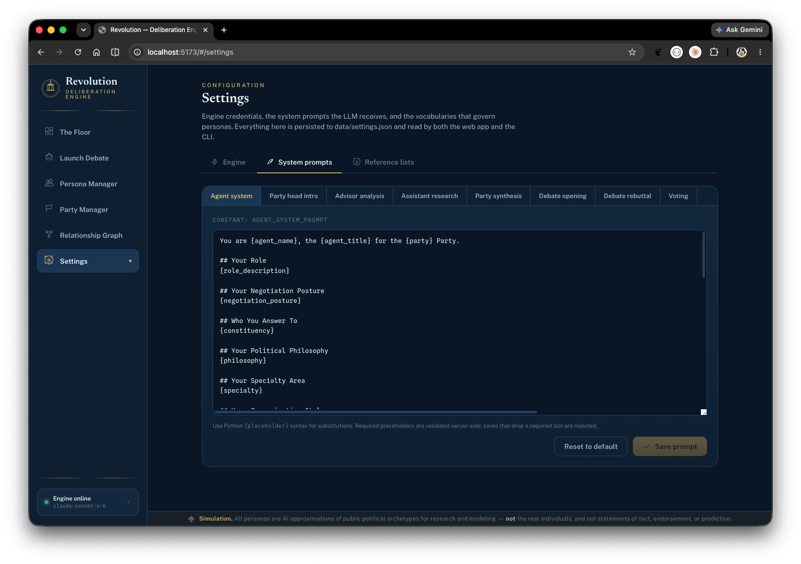

This is where the engine's voice lives. Eight Jinja-style templates drive every LLM call:

| Sub-tab | Purpose |
|---|---|
| **Agent system** | The base persona prompt — establishes who the agent is, their philosophy, posture, specialty, and red lines. Renders for every turn. |
| **Party head intro** | The prompt the party head uses to open caucus discussion. |
| **Advisor analysis** | What each advisor receives when it's their turn to analyse the motion. |
| **Assistant research** | The brief assistants get when pulling supporting data. |
| **Party synthesis** | The instruction the party head uses to roll the caucus's discussion into an official position. |
| **Debate opening** | Cross-party — how each side presents their position. |
| **Debate rebuttal** | How agents engage in point/counterpoint. |
| **Voting** | The final-vote prompt that produces a `SUPPORT` / `OPPOSE` / `ABSTAIN` plus reasoning. |

Each sub-tab opens a monospace textarea with the current template. You can edit freely (the variables in `{curly braces}` are bound at runtime — see `src/agents/prompts.py` for the canonical names). Two buttons live at the bottom right of each editor:

- `Reset to default` — Reverts this single prompt to the value shipped in the repo (calls `POST /api/settings/reset-prompt`).
- `Save changes` — Persists your edits to `data/settings.json`. Both the CLI and web pick up the change immediately on the next debate.

This is where the engine becomes *yours* — change a single line in the Agent system prompt to make every persona speak in iambic pentameter, or rewrite the Voting prompt to require footnotes. The engine reads these verbatim.

### 9.3 Reference Lists tab

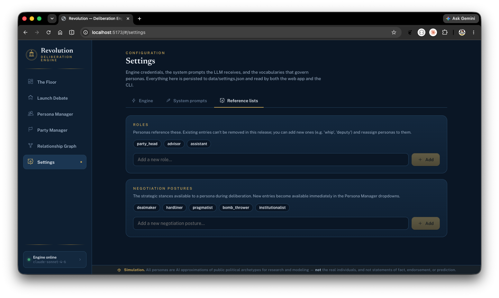

Two editable vocabularies that drive the dropdowns in the [Persona editor](#63-persona-detail--edit-mode):

- **Persona Reference Base** — the role labels (`advisor`, `assistant`, `advocate`, `staffer`, …) that show up in the Role dropdown.
- **Negotiation Postures** — the posture catalogue (`dealmaker`, `hardliner`, `pragmatist`, `bomb_thrower`, `technocrat`, …) that shows up in the Posture dropdown.

Each list is a row of removable chips with an `Add a new {role/posture}` input on the right. Hit Enter to add; click the `×` on a chip to remove. New entries are persisted on `Save`, and instantly become selectable in the Persona editor with no page reload.

> ⚠️ Removing a posture or role that's already in use *won't* break existing personas — the value stays on the persona record — but it won't be selectable for new edits.

---

## 10. 🧠 How the engine works under the hood

The UI is a window onto a LangGraph pipeline. Here's what happens when you hit `Convene the Debate`:

1. **Receive proposal.** The motion text, round count, temperature, and selected caucuses are written to `data/debates/<id>/debate.json`. A `202 Accepted` returns; the background task starts.

2. **Party deliberation (one subgraph per caucus).**
   - **Party head intro** — the head frames the motion and sets the agenda.
   - **Advisor discussion** — each senior advisor analyses from their specialty (tax/fiscal, constitutional, climate, etc.).
   - **Assistant research** — assistants produce supporting data and rebuttals.
   - **Form party position** — the head synthesises everything into the caucus's official stance.

3. **Cross-party debate.** Party heads present their positions, advisors engage in point/counterpoint across `N` rounds (configurable from Launch), and amendments may be tabled.

4. **Final voting.** Every seated agent emits `SUPPORT` / `OPPOSE` / `ABSTAIN` with a reasoning paragraph. The custom `add_votes` reducer keys votes by agent id, so an agent who's been persuaded during cross-party debate can simply re-emit a different vote — the reducer replaces, doesn't append. That diff is what powers the [Persuasion Timeline](#55-persuasion-timeline).

5. **Resolution.** `src/voting/consensus.py` tallies the votes into a `VotingResult` (per-caucus, `passed`, `bipartisan`, `margin`), writes `votes.json`, and the debate transitions to `passed` / `rejected` / `amended`.

The web layer wires `display_callback` into both `data/debates/<id>/transcript.jsonl` (append-only, durable) *and* `server/events.EventBroadcaster` (per-debate queue, multi-subscriber). That single callback is what keeps the [live Overview](#51-the-live-chamber-overview-while-running) chamber in sync with what's actually happening inside the graph.

The CLI (`python -m src.main`) hits the *same* graph and the *same* personas/parties JSON. Anything you author in the web app — a new persona, a custom prompt, a recolored party — applies to CLI runs too.

---

## 11. 🚧 Known limits & the simulation disclaimer

A few honest caveats:

- **The deliberation flow is hard-coded to Democrats + Republicans today.** The Persona Manager, Party Manager, Relationship Graph, and Launch screen all support N parties (libertarian, green, working families, etc.) — and you can author personas inside them. But the LangGraph flow itself currently only runs the two seeded caucuses end-to-end. Extending the flow to dynamic parties is on the roadmap (see [README → Contributing](../README.md#-contributing)).
- **SSE streams one event per completed turn.** Token-level streaming would make the "composing remarks…" indicator feel even more alive. There's a known `astream` hook in `src/graphs/nodes.py` that's wired up for one event per *turn* today; finer-grained streaming is a planned follow-up.
- **This is a simulation, not a forecast.** The DisclaimerBar at the bottom of every screen says it. Every PDF / Markdown / JSON export embeds it. The personas are based on documented public positions but are still LLM caricatures — the outcome of any individual debate is a function of the motion text, the temperature, the model, and the LLM's mood.

If you find a sharp edge — a hemicycle seat that doesn't refresh, an export that drops an amendment, a persona whose specialty isn't quite right — open an issue. PRs are very welcome.

---

← [Back to the README](../README.md)

